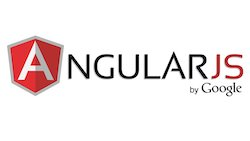
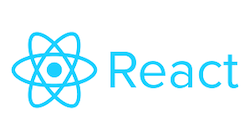
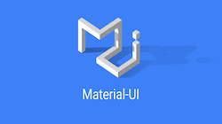

**IoT Angular and React Reporting Reference Applications**
==================
The example [IoT Angular Reporting Reference application](https://github.com/markreha/cloudappAngular/blob/master/README.md) and [IoT React Reporting Reference application](https://github.com/markreha/cloudappReact/blob/master/README.md) each implement a simple IoT Reporting application that can be used to display the posted data from the [IoT Device Raspberry Pi Sense HAT](https://github.com/markreha/cloudpi/blob/master/README.md) application. The IoT Angular and React Reporting Reference applications each consumes a REST API published by the [IoT Services Reference](https://github.com/markreha/cloudservices/blob/master/README.md) application. These applications in combination  demonstrate a simple, scalable, Cloud based IoT application. Get the [Cloud Workshop SDK!](https://github.com/markreha/cloudworkshop/blob/master/README.md)

 

